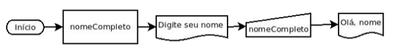
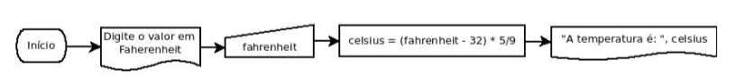

## [Questão 1](./1.c)



```c
#include <stdio.h>

int main(void) {
    char nomeCompleto[100];
    puts("Digite seu nome completo: ");
    gets(nomeCompleto);
    printf("Ola, %s", nomeCompleto);
   return 0
}
```

## [Questão 2](./2.c)

Faça um programa que calcule a altura, o perímetro e a área de um triângulo equilátero  (possui todos lados iguais). O usuário deve informar o tamanho do lado.

```c
#include <stdio.h>
#include <math.h>

int main(void) {
    float lado, area, altura, perimetro=0;

    puts("Lado: ");
    scanf("%f", &lado);

    perimetro = lado * 3; 
    altura = ( lado * sqrt(3) ) / 2;
    area =  ( lado * sqrt(3) ) / 4;
    
    printf("\nArea: %.2f", area);
    printf("\nPerimetro: %.2f", perimetro);
    printf("\nAltura: %.2f", altura);
   return 0;
}
```

## [Questão 3](./3.c)

A queda livre de um objeto (desconsiderando qualquer forma de resistência) é dada pela equação: 
Fórmula: d = 1/2 * g * (t^2)
Onde "d' é o deslocamento, "g" a aceleração da gravidade (9,81m/s² na Terra) e "t" o tempo.

Faça um programa que calcule a distância percorrida por um objeto abandonado no ar após um dado tempo em segundos informado pelo usuário. 

O programa deve.
- Pedir ao usuário que informe o tempo em segundos
- Calcular a distância percorrida
- Escreve a distância em metros.

```c
#include <stdio.h>
#include <math.h>

#define GRAVIDADE 9.81

int main(void) {
    int segundos;
    float distancia;

    printf("Entre com o tempo de queda: ");
    scanf("%i", &segundos);

    distancia = (pow(segundos, 2) * GRAVIDADE)/2;

    printf("\nDistancia percorrida de: %.2f m", distancia);
   return 0;
}

```

## [Questão 4](./4.c)



```c
#include <stdio.h>
#include <math.h>

int main(void)
{
    float fahrenheit, celsius;

    printf("Digite um valor em Fahrenheit: ");
    scanf("%f", &fahrenheit);

    celsius = (fahrenheit - 32) * 5/9;

    printf("\nA temperatura e %.2f celsius", celsius);
    return 0;
}

```

## [Questão 5](./5.c)

ALGORITMO
    ESCREVER "Digite a distância"
    LER distancia
    ESCREVER "Informe o gasto médio do veículo(km/L)"LERkmL
    ESCREVER "Informe o custo do combustível(R$/L)"
    LER precoCombustivel
    ESCREVER "Informe total de pedágios" 
    LER precoPedagios
    totalViagem = distancia * precoCombustivo/kmL + precoPedagios
    ESCREVER "A viagem custará:", totalViagem
FIM_ALGORITMO

```c
#include <stdio.h>

int main(void)
{
    float distancia, kmL, precoCombustivel, precoPedagios, totalViagem;

    printf("Digite a distancia: ");
    scanf("%f", &distancia);

    printf("Informe o gasto medio do veiculo(km/L):  ");
    scanf("%f", &kmL);

    printf("Informe o custo do combustivel(R$/L): ");
    scanf("%f", &precoCombustivel);

    printf("Informe total de pedagios: ");
    scanf("%f", &precoPedagios);

    totalViagem = distancia * precoCombustivel / kmL + precoPedagios;
    printf("A viagem custara: %.2f", totalViagem);
    return 0;
}

```

## [Questão 6](./6.c)

Foram formados grupos com números de integrantes diferentes.A cada integrante é dado um número por ordemal fabética.É necessário escolher aleatoriamente um integrante para representar o grupo. Crie um programa que, dado o número de integrantes,escolha aleatoriamente um número.

```c
#include <stdio.h>
#include <stdlib.h>
#include <time.h>

int main(void)
{
    int numeroIntegrantes;

    printf("Digite o numero de integrantes: ");
    scanf("%i", &numeroIntegrantes);

    srand(time(NULL));
    int sorteado = (rand() % numeroIntegrantes) + 1;

    printf("Valor aleatorio: %i", sorteado);
    return 0;
}

```

## [Questão 7](./7.c)
Faça uma calculadora que,dado um ângulo em graus, calcule Seno, Cosseno e Tangente desse ângulo. Lembre-se que o valor passado para a função deve ser dado em radianos.
radianos = graus * PI/180

```c
#include <stdio.h>
#include <math.h>
#define PI 3.1415

int main(void)
{
    double grau, radianos;
    
    printf("Digite o grau: ");
    scanf("%lf", &grau);

    radianos = grau*PI/180;

    printf("\nSeno: %.2f", sin(radianos));
    printf("\nCosseno: %.2f", cos(radianos));
    printf("\nTangente: %.2f", tan(radianos));

    return 0;
}

```

## [Questão 8 ] (./8.c)
ALGORITMO
    TAXA=0.08
    JUROS= 0.0025
    MULTA=0.4
    ESCREVER "Informe o período em meses:" 
    LER meses
    ESCREVER "Informe o valor do salário base:" 
    LER salario
    depositoMensal = salario * TAXA
    ESCREVER "Depósito mensal R$:", depositoMensal
    saldoCorrigido = depositoMensal * (1+JUROS) * (((1+JUROS)^meses)-1))/JUROS
    ESCREVER "Saldo Corrigido R$:", 
    saldoCorrigidomulta = saldoCorrigido * MULTA
    ESCREVER" Multa por demissão R$:",multatotal = saldoCorrigido + multa
    ESCREVER "TotalFGTS mais 40% de multa",total
FIM_ALGORITMO

```c
#include <stdio.h>
#include <math.h>

#define TAXA 0.08
#define JUROS 0.0025
#define MULTA 0.4

int main()
{
    int meses;
    float salario, depositoMensal, saldoCorrigido, multa, total;

    printf("\nInforme o periodo em meses: ");
    scanf("%i", &meses);

    printf("\nInforme o valor do salario base: ");
    scanf("%f", &salario);

    depositoMensal = salario * TAXA;

    printf("\nDeposito mensal R$: %.2f", depositoMensal);

    saldoCorrigido = (depositoMensal * (1 + JUROS) * (pow((1 + JUROS), meses) - 1)) / JUROS;

    printf("\nSaldo Corrigido R$%.2f", saldoCorrigido);

    multa = saldoCorrigido * MULTA;

    printf("\nMulta por demissao R$%.2f", multa);

    total = saldoCorrigido + multa;

    printf("\nTotal FGTS mais 40%c de multa: %.2f", '%',total);

    return 1;
}
```