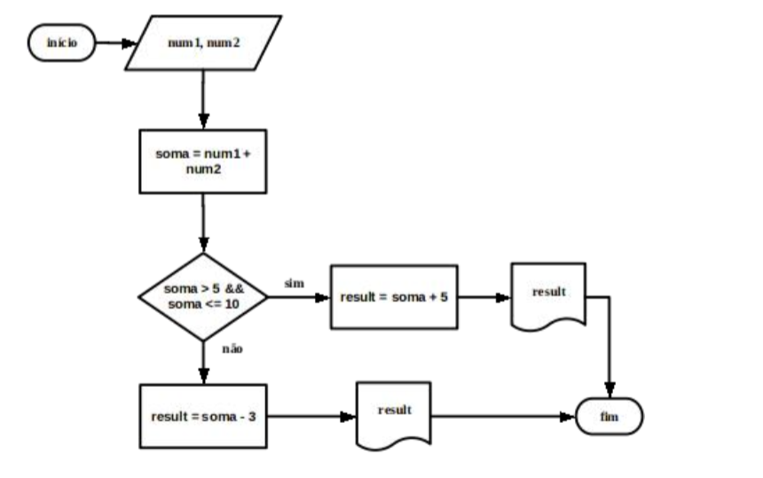
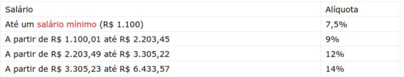

## [Questão 1](./1.c)
#### Enunciado:
````
ALGORITMO
	num1 = valor aleatório entre 0 e 10 
		ESCREVA "Adivinhe o número:"
	LEIA num2 
	SE num1 == num2 ENTÃO
		ESCREVA "Parabéns,você acertou!"
	SENÃO SE num2 < num1 
		ESCREVA "Você errou, chute baixo!" 
	SENÃO
		ESCREVA "Você errou, chute alto!"
	ESCREVA "O número era: ", num1, "Fim do jogo"
FIM_ALGORITMO
````
#### Código:
```c
#include <stdio.h>
#include <stdlib.h>
#include <time.h>

int main(void){
	srand(time(NULL));
	int num1 = rand() % 10 + 1;
	int num2;	
	printf("Adivinhe o numero:");
	scanf("%i",&num2);

	if(num1 == num2){
		puts("Parabéns você acertou!");
	} else if(num2 < num1){
		puts("Você errou, chute baixo!");
	}else{
		puts("Você errou, chute alto!");
	}
	printf("O número era: %i\n", num1);
	puts("Fim do jogo");
    	return 0;
}
```

## [Questão 2](./2.c)



```c
#include <stdio.h>

int main(void){
	int num1, num2;	
	printf("Infome o primeiro numero:");
	scanf("%i",&num1);

	printf("Infome o segundo numero:");
	scanf("%i",&num2);
	
	int result, soma = num1 + num2; 
	
	if(soma > 5 && soma <= 10){
		 result = soma + 5;
	} else {
		result = soma - 3;
	}
	printf("%i", result);
    	return 0;
}
```

## [Questão 3](./3.c)

Escreva um programa que calcule o índice de massa corpórea. O usuário deve digitar altura e massa e o programa deve retornar a descrição Grau de desnutrição ou Obesidade).
IMC = massa / (altura*altura)
- Se IMC < 10: Desnutrição Grau V 
- Se IMC >= 10 e < 13: Desnutrição Grau IV
- Se IMC >= 13 e < 16: Desnutrição Grau III 
- Se IMC >= 16 e < 17: Desnutrição Grau II
- Se IMC >= 17 e < 18,5: Desnutrição GrauI
- Se IMC >= 18,5 e < 25: Normal 
- Se IMC >= 25 e < 30: Pré-obesidade
- Se IMC >= 30 e < 35: Obesidade Grau I 
- Se IMC >= 35 e < 40: Obesidade Grau II(Severa)
- Se IMC >= 40: Obesidade Grau III(Mórbida)

```c
#include <stdio.h>

int main(void)
{
	float altura, massa;
	
	printf("Infome o peso (Kg):");
	scanf("%f", &massa);

	printf("Infome a altura (m):");
	scanf("%f", &altura);

	float IMC = massa / (altura * altura);
	printf("Seu IMC é %.2f\n", IMC);	

	if (IMC < 10){
		puts("Desnutrição Grau V");
	}else if (IMC >= 10 && IMC < 13){
		puts("Desnutrição Grau IV");
	}else if (IMC >= 13 && IMC < 16){
		puts("Desnutrição Grau III");
	}else if (IMC >= 16 && IMC < 17){
		puts("Desnutrição Grau II");
	}else if (IMC >= 17 && IMC < 18.5){
		puts("Desnutrição Grau I");
	}else if (IMC >= 18.5 && IMC < 25){
		puts("Normal");
	}else if (IMC >= 25 && IMC < 30){
		puts("Pré-obesidade");
	}else if (IMC >= 30 && IMC < 35){
		puts("Obesidade Grau I");
	}else if (IMC >= 35 && IMC < 40){
		puts("Obesidade Grau II (Severa)");
	}else if (IMC >= 40){
		puts("Obesidade Grau III (Mórbida)");
	}

	return 0;
}
```

## [Questão 4](./4.c)

A fórmula de Bhaskara é um cálculo matemático para determinar as raízes de uma função de segundo grau na forma ax²+bx+c=0, por meio de seus coeficientes (a,b,c). 

Escreva um programa em que, dados os coeficientes a, b e c, retorne a forma da parábola, as raízes da equação (x’ e x”) e o vértice da parábola (xv, yv).Observe as regras:

__Forma da parábola__
- Se a > 0, parábola voltada para cima
- Se a < 0, parábola voltadaparabaixo
- Sea=0,equaçãode1ºgrau

__Raízes__
∆ = b² - 4 * a * c (discriminantes)

- ∆ > 0; duas raízes. A parábola toca a reta x em dois ponto (x é secante à parábola) 
- ∆ = 0; umaúnicaraiz(ovérticedaparábolatocaaretax)
- ∆ < 0; a parábola não toca a reta x.

x’ = (-b + √(∆))/2 * a  (Bhaskara) Raízes da equação 
x” = (-b - √(∆))/2 * a  (Bhaskara)Raízes da equação 

__Vértice da parábola__
xv = -b/(2 * a) (ponto localiza do no vértice da parábola)
yv = -∆/(4 * a)

```c
#include <stdio.h>
#include <math.h>

int main(void)
{
	double a, b, c, delta, x1, x2, xv, yv;
	
	// Recebe o input do usu�rio
	printf("a = ");
	scanf("%lf", &a);

	printf("b = ");
	scanf("%lf", &b);

	printf("c = ");
	scanf("%lf", &c);
	
	// Calcula o delta 
	delta = pow(b,2) - (4 * a * c);

	// Calculas ra�zes
	x1 = ( b*(-1) + sqrt(delta) ) / (2 * a);
	x2 = ( b*(-1) - sqrt(delta) ) / (2 * a);

	// Calcula as coordenadas do v�rtice
	xv = ( (-1) * b ) / ( 2 * a );
	yv = ( (-1) * delta ) / ( 4 * a );
	
	// Imprime os resultados
	printf("\nDuas raizes: %.2lf %.2lf", x1, x2);
	printf("\nVertice: (%.2lf, %.2lf)", xv, yv);

	return 0;
}
```

## [Questão 5](./5.c)

Para calcular a alíquota paga ao INSS sobre um salário é utilizada a tabela abaixo.Dependendo do valor salarial é necessário passar pelas 4 etapas de cálculo.



```c
#include <stdio.h>
#include <math.h>

int main(void)
{
	double salario, aliquota = 0;
	
	// Recebe o salário
	printf("Digite seu salário: ");
	scanf("%lf", &salario);

	// Calcula a taxa com base no salario
		if(salario >= 0 && salario <= 1100){
			aliquota += salario * 0.075;
		}else if(salario >= 1100.01 && salario <= 2203.45){
			// Valor referente a primeira faixa (1100 * 0.075)
			aliquota += 82.50;
			// Valor faltante
			aliquota += (salario - 1100) * 0.09; 
		}else if(salario >= 2203.49 && salario <= 3300.22){
			// Valor referente a primeira e segunda faixa (1.103.48 * 0.09)
			aliquota += 82.50 + 99.31;
		        // Valor faltante
			aliquota += (salario - 2203.48) * 0.12;	
		}else if(salario >= 3305.23 && salario <= 6433.57){
			// Valor referente a primeira e segunda faixa (1.103.48 * 0.09)
			aliquota += 82.50 + 99.31 + 132.21;
		        // Valor faltante
			aliquota += (salario - 3305.23) * 0.14;
		} else{
			// Valor m�ximo a ser pago
			aliquota += 82.50 + 99.31 + 132.21 + 437.97;
		}
	
	// Imprime os resultados
	printf("\nAliquota do INSS: %.2lf", aliquota);

	return 0;
}
```
